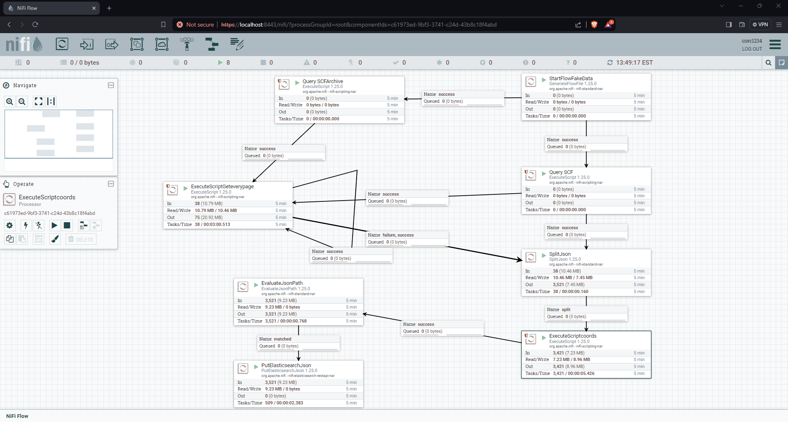
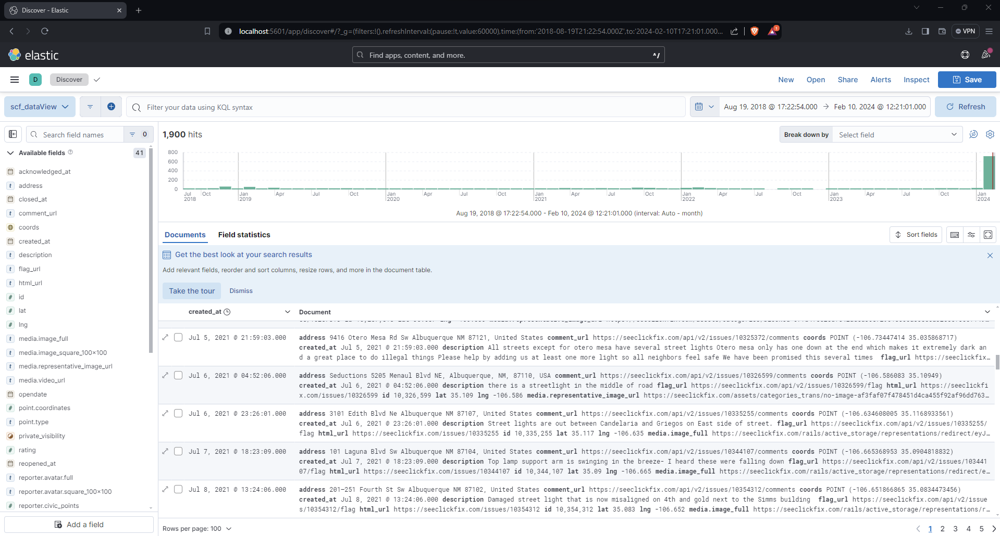
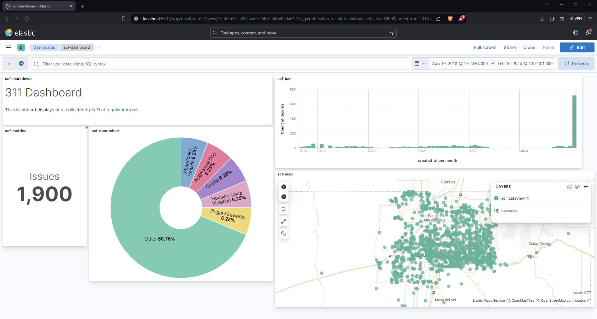

# 311 Data Pipeline with Apache NiFi, Elasticsearch, and Kibana

This repository contains a comprehensive data pipeline designed to collect, process, and visualize 311 service request data using Apache NiFi, Elasticsearch, and Kibana. The pipeline connects to the SeeClickFix API to download both current and archived service request issues for a specified county, loads the data into Elasticsearch for storage and indexing, and then it can be visualized through Kibana dashboards.

## Getting Started

To run the pipeline on your machine, follow these instructions:

### Prerequisites

- Install [Apache NiFi](https://nifi.apache.org/) on your system.
- Install [Elasticsearch](https://www.elastic.co/elasticsearch/) and [Kibana](https://www.elastic.co/kibana) on your system.
  
### Installation

1. Clone this repository to your local machine.
2. Create an index in Kibana named `scf` with a `geopoint` mapping. You can do this by running the following code in the Dev Tools page of Kibana:

    ```json
    PUT scf
    {
      "mappings": {
        "properties":{
          "coords":{
            "type": "geo_point"
          }
        }
      }
    }
    ```

3. Import the XML file named `SCFPipeline.xml` into your NiFi canvas. This file contains the entire data pipeline configuration.

### Usage

1. Start Apache NiFi.
2. Start the pipeline in NiFi.
3. Monitor the Elasticsearch index to ensure data is being indexed properly.
4. Create DataViews in Kibana to visualize the indexed data.
5. Explore and analyze the data using Kibana dashboards.

## Demo

Included below, in order, are sample screenshots of the NiFi pipeline, Elasticsearch index in Kibana and Kibana dashboard created using the data collected by the pipeline.






